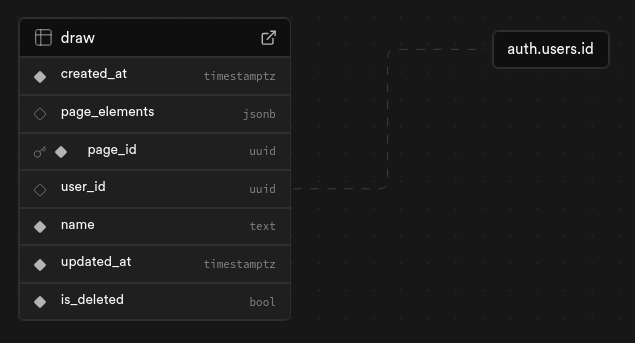

## Supabase Setup and Schema

### Structure

The structure of the database is meant to make it super easy and secure to get Draw up and running.
[](./assets/Draw-Readme-DB-Schema.png)

### Instructions

To get started, first create a Supabase Account and a new project.

Go to the SQL Editor and run the following SQL Queries:

Create the table

```
CREATE TABLE draw (
  created_at timestamp with time zone NOT NULL DEFAULT now(),
  page_elements jsonb NULL,
  page_id uuid NOT NULL DEFAULT gen_random_uuid(),
  user_id uuid NULL,
  name text NOT NULL DEFAULT 'New Page',
  updated_at timestamp with time zone NOT NULL DEFAULT now(),
  is_deleted boolean NOT NULL DEFAULT false,
  CONSTRAINT draw_pkey PRIMARY KEY (page_id),
  CONSTRAINT draw_user_id_fkey FOREIGN KEY (user_id) REFERENCES auth.users(id) ON UPDATE CASCADE
);
```

Enable RLS (read more about RLS [here](https://supabase.com/docs/guides/database/postgres/row-level-security))

```
alter table "draw" enable row level security;
```

Add the RLS Policies

```
CREATE POLICY "Enable read access for all users" ON draw
FOR SELECT
TO public
USING (true);

CREATE POLICY "Enable insert for authenticated users only" ON draw
FOR INSERT
TO authenticated
WITH CHECK (true);

CREATE POLICY "Enable update for authenticated users only" ON draw
FOR UPDATE
TO authenticated
USING ((select auth.uid()) = user_id)
WITH CHECK (true);

CREATE POLICY "Enable delete for users based on user_id" ON draw
FOR DELETE
TO authenticated
USING ((select auth.uid()) = user_id);
```

## Authentication

Enable **Confirm email** in the Supabase Dashboard (Authentication → Sign In / Providers → Email) so new users verify their email address before signing in.

Enable the **Google provider** (Authentication → Sign In / Providers → Google) with a Client ID and Secret from the [Google Cloud Console](https://console.cloud.google.com/apis/credentials). The authorized redirect URI for the OAuth consent screen is `https://<project-ref>.supabase.co/auth/v1/callback`.

Enable **Manual Linking** (Authentication → Sign In / Up → Manual Linking) so users can link their Google account from the Profile page.

Add the following to **Redirect URLs** (Authentication → URL Configuration), using your production origin where applicable:

- `http://localhost:5173/pages` — used after email verification and Google sign-in
- `http://localhost:5173/update-password` — used by the password reset flow
- `http://localhost:5173/profile` — used when linking a Google account

## Email Templates

The auth email templates (Confirm signup, Reset password, Change email address) live in the [`email-templates/`](../email-templates) folder as a [React Email](https://react.email) project.

Preview them locally with the React Email dev server:

```sh
cd email-templates
bun install
bun run dev
```

Export them to static HTML:

```sh
EMAIL_ASSETS_BASE_URL="https://your-domain.com" bun run export
```

`EMAIL_ASSETS_BASE_URL` should be your deployed app's origin — it makes the logo URL in the emails absolute (the logo is served from `public/static/draw-logo.png`). The exported files land in `email-templates/out/` with Supabase's `{{ .ConfirmationURL }}`, `{{ .Email }}` and `{{ .NewEmail }}` variables already in place.

Paste each exported file into the matching template in the Supabase Dashboard (Authentication → Emails):

| File                  | Template              | Suggested subject            |
| --------------------- | --------------------- | ---------------------------- |
| `confirm-signup.html` | Confirm signup        | Confirm your email address   |
| `reset-password.html` | Reset password        | Reset your password          |
| `change-email.html`   | Change email address  | Confirm your new email       |
